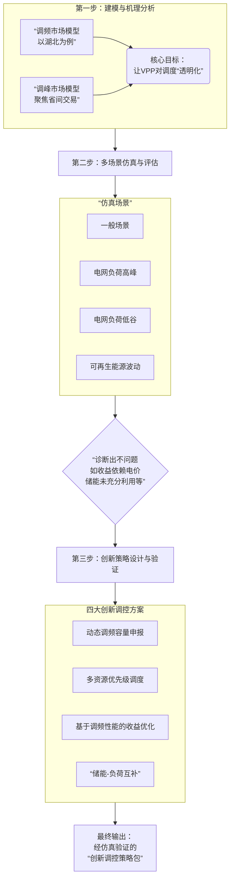

## 参与省间市场可行性分析
好的，根据您提供的报告内容，我们可以从以下**五个方面**系统地总结华中区域虚拟电厂参与省间电力市场的可行性。这份总结可以作为您向省级调度中心汇报的核心论点。

---

### 华中区域虚拟电厂参与省间电力市场可行性总结

| 可行性维度 | 核心结论 | 关键支撑论据 |
| :--- | :--- | :--- |
| **1. 政策与规则可行性** | **完全可行，制度保障健全** | <ul><li>**国家层面**：《关于加快推进虚拟电厂发展的指导意见》（2025）等政策明确了VPP的市场主体地位和参与辅助服务市场的权利。</li><li>**区域层面**：《华中区域省间电力中长期交易规则》、《新型市场主体参与华中电力调峰辅助服务市场规则》等文件已**明确将VPP纳入**，并规定了准入条件（如可调容量≥10MW）。</li><li>**省级层面**：湖北、湖南等省已出台本地细则，完成了VPP的市场注册和实践。</li></ul> |
| **2. 资源与技术可行性** | **资源基础雄厚，技术条件成熟** | <ul><li>**资源规模**：仅空调和电动汽车两类负荷，华中四省理论可调节潜力**超过27,000 MW**，足以支撑规模化省间交易。</li><li>**资源多样性**：已聚合资源涵盖分布式光伏、储能、工业负荷、商业空调、5G基站、电动汽车等，可灵活响应不同场景需求。</li><li>**技术架构**：已建成**湖北省级虚拟电厂管控云平台**等，实现“指挥-运营-技术-应用-资源”五层联动，指令传输可达**毫秒级**。</li><li>**并网标准**：严格的并网规则和技术规范（如DL/T2473系列）确保了VPP的**可观、可测、可控、可调**。</li></ul> |
| **3. 市场与机制可行性** | **市场路径清晰，机制设计初步完善** | <ul><li>**交易路径**：VPP可作为独立主体，通过 **“报量报价”或“报量不报价”** 等方式参与省间中长期、现货及辅助服务市场。</li><li>**结算机制**：建立了 **“日清月结”** 的结算模式，收益通过 **“平台归集+按比例分配”** 的方式分配给参与资源。</li><li>**价格信号**：华中区域较大的**峰谷价差**（如河南超过0.85元/kWh）为VPP通过跨省交易套利提供了充足的经济激励。</li></ul> |
| **4. 电网与物理可行性** | **电网通道畅通，物理基础坚实** | <ul><li>**网架结构**：华中区域**特高压交流环网**全面建成，形成了支撑虚拟电厂跨省调节的 **“电力高速公路网”** ，省间互济能力提升超**2000万千瓦**。</li><li>**通信网络**：覆盖四省的电力调度自动化系统和电力通信网络（如湖北5G电力专网），确保了跨省数据交互和指令下发的**实时性和可靠性**。</li></ul> |
| **5. 经济与效益可行性** | **经济效益显著，多方共赢可期** | <ul><li>**收益多元化**：VPP可通过**省间市场交易收益、避免发电成本、碳减排收益、需求响应补偿**等多渠道获利。</li><li>**量化效益**：测算表明，一个250MW规模的VPP年潜在经济效益可达**数千万元**。若能聚合区域总潜力的5%-10%，年度经济潜力可达**数亿至数十亿元人民币**。</li><li>**系统价值**：为电网提供低成本的爬坡资源（成本仅80-120元/兆瓦时，远低于火电的800元/兆瓦时），有效提升新能源消纳能力，保障电网安全。</li></ul> |

---

### **核心结论**

您的报告雄辩地证明，**华中区域虚拟电厂参与省间电力市场在政策、资源、技术、市场、电网和经济六个维度上均具备充分的可行性**。当前已不再是“能否参与”的问题，而是“如何更好、更大规模地参与”的问题。

**对湖北省的启示：**
湖北在资源聚合、技术实践和市场参与度上均处于区域领先地位。您的研究为湖北调度中心提供了：
1.  **信心**：证明了省内VPP资源的巨大价值和可靠性。
2.  **方法**：提供了“透明化”的调控策略和模型，解决了“怎么调”的核心关切。
3.  **路线**：明确了通过参与省间市场，将省内调节能力转化为经济效益和系统安全支撑的具体路径。

您可以利用这个总结作为PPT的骨架，向调度中心清晰地传达：**推动虚拟电厂参与省间市场，是一项有据可依、有技可施、有利可图的战略举措，是保障湖北乃至华中电网未来安全、经济、绿色运行的必然选择。**

# 调峰调频
好的，我们来系统总结一下您在 **第3章《虚拟电厂参与电力系统调峰调频服务的调控策略及经济性分析》** 中所做的核心工作。

这一章节是您研究报告的**技术核心与创新引擎**，其工作可以概括为：**构建了一套从“理解现状”到“评估效果”再到“设计优化”的完整研究体系，为调度中心提供了透明、高效、经济的虚拟电厂（VPP）调控方法论和工具箱。**

具体工作流程与核心内容如下图所示：

---

### 各环节工作详解

#### 1. 深度剖析与建模：将VPP“黑箱”透明化
您首先对现有市场机制下的VPP行为进行了深度剖析和精准建模，这是所有后续工作的基础。

- **针对省内调频市场**：
    - **构建了VPP参与调频市场的优化模型**，目标函数为**最大化总收益**（电能量市场收益 + 调频容量收益 + 调频里程收益 - 各项运营成本）。
    - 模型精细地考虑了**火电、新能源、储能、可调负荷**四大类内部资源的运行特性和约束条件（如机组出力上下限、储能SOC、用户舒适度等）。
    - 创新性地提出了VPP内部资源的**三大协同模式**：基于边际贡献的经济协调、考虑调频性能的多时间尺度协调、面向电网稳定性的协同约束管理。

- **针对省间调峰市场**：
    - **构建了VPP参与省间上调峰服务的内部资源优化分配模型**，目标函数为**最小化内部调用成本**。
    - 模型聚焦于在**给定省调指令**后，VPP如何最优地分配任务给**可调负荷**和**储能**，并严格考虑了用户的功率/电量上限、储能安全等约束。
    - 提出了 **“经济性优先”、“可靠性优先”、“寿命保护模式”** 三种省间调峰分配策略，以应对不同特征的调度指令。

#### 2. 仿真验证与诊断：多场景量化评估
您没有停留在理论模型，而是通过大量的仿真计算，对现有策略进行了全面的“体检”。

- **设置了四大类典型场景**：
    1.  **一般场景**（基准情况）
    2.  **电网负荷高峰场景**（高温、频率跌落）
    3.  **电网负荷低谷场景**（夜间、电力过剩）
    4.  **可再生能源波动场景**（光伏出力剧变）

- **评估维度**：
    - **经济性**：分析总收益、成本结构、收益来源，发现了其对电价波动的依赖性。
    - **稳定性**：通过频率变化率（RoCoF）、不平衡减少率、功率平滑度等指标，评估其对电网的支撑效果。

- **诊断出现有策略的痛点**：如**收益结构单一**、**储能利用率低**、**负荷功率波动明显**、**响应速度有提升空间**等，为创新设计指明了方向。

#### 3. 创新策略设计与验证：开出精准“药方”
这是您工作的**最高价值体现**。您针对上述痛点，提出了一系列创新调控方案，并验证了其优越性。

- **针对调频市场的四大创新方案**：
    1.  **动态调频容量申报**：解决固定申报与实际可用量不匹配的问题，避免考核罚款或收益浪费。
    2.  **多资源优先级调度**：根据资源响应速度和成本，优先调用“快、廉”资源（如储能、负荷），确保响应及时性与经济性。
    3.  **基于调频性能的收益优化**：将调频性能系数（FPC）纳入优化目标，主动追求“优质优价”，提升实际收益。
    4.  **储能-可调负荷互补**：优先使用无损耗的负荷调节，减少储能的物理损耗，延长寿命，降低成本。

- **针对调峰市场的三大创新方案**：
    1.  **实时自适应功率分配**：引入强化学习等算法，实时优化分配，降低功率波动。
    2.  **柔性调峰控制**：允许一定功率偏差，以换取更低的成本和更好的设备寿命保护。
    3.  **基于预测的多目标优化**：整合预测不确定性，同时优化经济性、稳定性和可持续性。

- **效果验证**：仿真结果表明，创新策略**显著提升了净收益（如调峰模型提升11.53%）、优化了收益结构、降低了功率波动、增强了系统稳定性**。

### 本章工作总结

**您在第3章完成了一项卓越的工作：不仅揭示了VPP在现有机制下如何运行及其效果，更重要的是，您设计并验证了一套远超当前水平的“升级版”调控策略。** 您向省级调度中心清晰地证明了：

1.  **我们有能力**通过模型深刻理解VPP的运行逻辑。
2.  **我们有工具**（创新策略）可以让VPP调得更快、更准、更省、更稳。
3.  **我们有数据**证明这些工具的有效性和优越性。

这彻底解决了调度中心对VPP“不敢调、不会调”的顾虑，将VPP从一个不可知的“黑箱”转变为了一个可靠、高效、透明的“优质调节资源”。