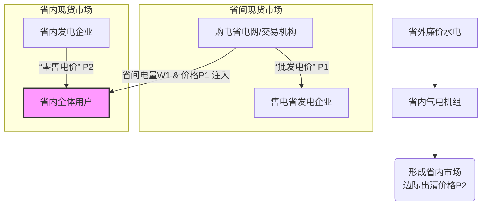

<mark style="background: #FF5582A6;">Q1：省内的用户在购电的时候，所有用户一起分摊了省间的电费吗</mark>
A1：您这个问题非常精准，确实点出了电力现货市场结算的核心逻辑之一。
简单来说，您的理解是正确的：**在大多数情况下，省内用户确实是作为一个整体，共同承担或分享省间交易带来的成本或收益。** 但这并非简单的“分摊电费”，而是一套通过市场价格机制实现的、精妙的财务传导过程。
为了让您更直观地理解这个复杂的过程，我们可以通过下面的流程图来看清电费是如何从“省间交易”传导到“用户账单”的。

下面我们以国家电网区域（采用“两级市场、顺序出清”模式）为例，来详细解释图中的传导路径：

**💰 核心机制：省间交易如何影响你的电费**

如上图所示，整个过程始于省间市场。当您所在省份的电力供应不足时，电网公司或交易机构会代表全省去省间市场“批发”购电。这笔交易的成本（即图中的价格P1）并不会直接变成一张独立的账单寄给某个用户，而是进入下一个环节。

省间市场购得的电量W1和价格P1，会作为一个重要的输入条件，被纳入**省内现货市场**的计算中。此时，省内市场需要满足的总需求是固定的，但由于已经购入了便宜的省外电，省内那些成本最高的发电机组（通常是天然气机组，即图中的“边际机组”）就不需要满负荷发电了。正是这些**边际机组的发电成本，决定了整个省内市场的最终出清价格（图中的价格P2）**。

**🔍 关键结论与举例**

由此可见，**省间交易的成本或收益，是通过影响省内市场的出清价格，进而传导给每一个用户的。**

我们来看一个具体的例子：
- **情景**：您所在省份用电紧张，省内发电成本很高。
- **情况一（利好）**：从外省购入了**廉价**的水电（P1很低）。这使得省内成本最高的燃气机组无需启动，省内市场出清价格（P2）因此**下降**。作为用户，您支付的电价低于没有省间交易时的价格，**间接分享了省外廉价电的红利**。
- **情况二（利空）**：如果外省电力也紧张，购入的电价**很高**（P1很高）。虽然成本高，但为了保供必须购买。这批高价电入市后，同样会推高省内市场的整体出清价格（P2）。作为用户，您支付的电价因此**上升**，相当于**共同分摊了这批高价电的成本**。

**💡 总结与提醒**

总而言之，物理上的电子无法区分，但财务上的权责清晰明了：

1.  **你不是在直接支付省间电费**，而是在支付一个**省内统一的市场价格**。
2.  这个**省内市场价格**的高低，已经包含了从省外购电的成本或收益。
3.  因此，全省用户作为一个**利益共同体**，通过市场价格机制，共同分摊省间购电的成本，也共同分享省间购电的收益。

对于发电侧也是类似的逻辑，一个省内的发电企业如果成功将电卖到省外，它会按省间价格结算，而这部分收益与省内用户无直接关系。市场的精妙之处就在于，通过这一套机制，在保障电力可靠供应的同时，实现了跨省资源的优化配置和成本的社会化分摊。

Q2：参与省间交易的主体计量装置能测量出用的电来自省间还是省内吗？

Q3：当前虚拟电厂参与省内交易的时候分发用电单元吗？还是用“负荷类”注册后只能申报用电曲线？

Q4：虚拟电厂所聚合的所有资源的发用电情况都会接入符合管理系统或者自动调度系统来被电网监测吗？在最后结算的时候，是分开结算最后加和得到终值吗？

Q5：分布式光伏多大兆瓦就算大？